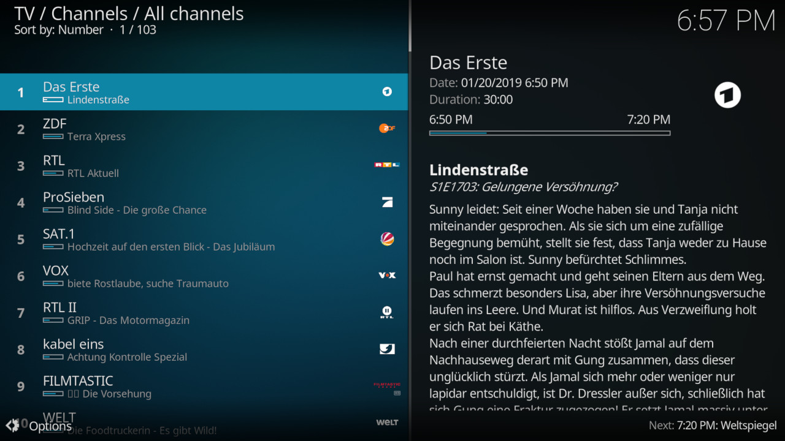
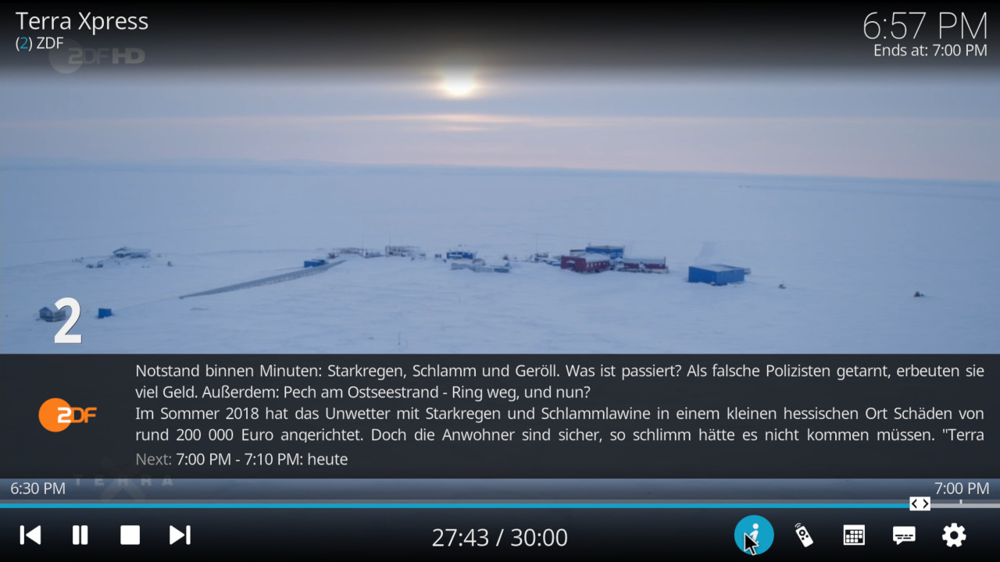

# Waipu PVR client for Kodi
This is the waipu PVR client addon for [Kodi](https://kodi.tv). It provides Kodi integration for the German TV streaming provider waipu.tv. A user account (free or paid) is required to use this addon.

## Preview Images

 

## Installation

pvr.waipu is a Kodi plugin and should be shipped with your installation or be available in the official repository. If it is not available, contact the distributor.

## Disclaimer

This is an *unofficial* (not related to Exaring AG) plugin. It is provided by volunteers and not related to Exaring AG or waipu.tv.
For any support regarding this plugin, please create a github issue.

## Build instructions

### Linux

1. `git clone --branch master https://github.com/xbmc/xbmc.git`
2. `git clone --branch Piers https://github.com/flubshi/pvr.waipu.git`
3. Build Kodi first
4. `cd pvr.waipu && mkdir build && cd build`
5. `cmake -DADDONS_TO_BUILD=pvr.waipu -DADDON_SRC_PREFIX=../.. -DCMAKE_BUILD_TYPE=Debug -DCMAKE_INSTALL_PREFIX=<Kodi-build-dir>/addons -DPACKAGE_ZIP=1 ../../xbmc/cmake/addons`
6. `make`

## Useful links

* [Kodi's PVR user support](https://forum.kodi.tv/forumdisplay.php?fid=167)
* [Kodi's PVR development support](https://forum.kodi.tv/forumdisplay.php?fid=136)
